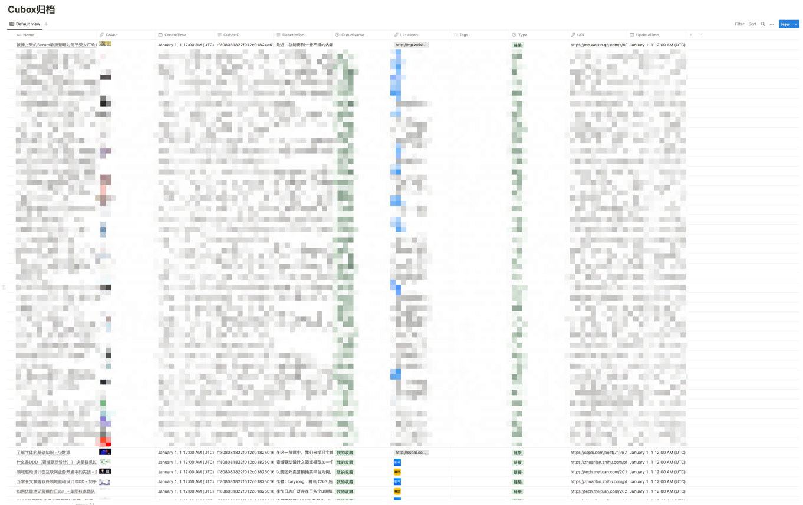
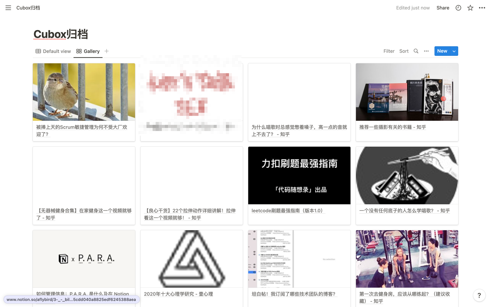
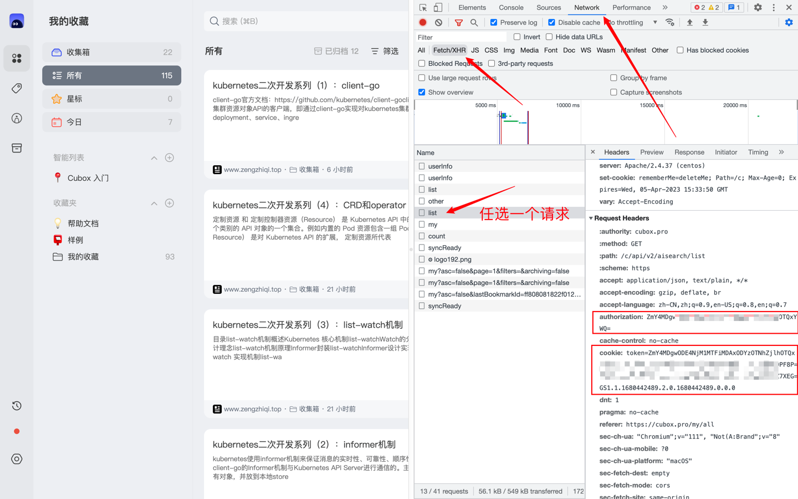

# Cubox Archiver

我很喜欢 [Cubox]((https://cubox.pro/)) 稍后读的多端收集功能。

我没有太多其他需求（如标注），只是想在读完后点击「归档」，并把归档内容作为一个知识库，以后可以通过标题和描述快速检索。

但 Cubox 免费版限制总数据条数200，归档的内容也会占用容量，开会员的话一年要 98。

所以我写了这个程序，用来把 Cubox 的归档内容自动同步到其他地方（Notion等），然后再把 Cubox 的归档内容删除了。

## 特性

- 抽象化归档器，支持多种归档方式
- 流式处理
- 自动去重
- 同时支持配置文件和命令行参数
- 自动发版

## 归档器

* [x] Notion：自动创建数据库，并同步数据，自动去重。
* [ ] CSV 文件（写了一半，去重逻辑还没写，建议用于测试）
* [ ] 数据库

## 效果



你要是愿意建立一个 gallery 视图，并且把 Cover 字段设置为预览的话，就可以看到这样的效果：



## 基本使用

术语介绍：

1. 程序形态：本质上是个命令行工具。可以下载二进制文件；也提供了 Docker 镜像，可以用 Docker、Kubernetes CronJob 等方式运行；也可以用定时的 GitHub Action 运行。
2. 数据源：Cubox 的稍后读列表。（目前只支持归档后的数据）
3. 归档器：把数据源的数据同步到其他地方的工具。一个数据源可以同时归档到多个归档器。
4. 配置：可以通过配置文件传入配置，也可以通过命令行参数传入配置。

## 前置条件 - 获取 Cubox 的登录信息



进入 Cubox 网页，打开开发者工具（F12），找到 Network 选项卡，刷新页面，随便选一个网络请求，记录请求头的 `authorization` 和 `cookie` 对应的值。（后面需要传入配置文件或命令行参数中）

## 支持的归档器

### Notion

请先创建一个 Notion 机器人，然后选定一个页面把机器人 Connection 进来。详见 [Notioin API 官方文档](https://developers.notion.com/docs)

1. 运行一次程序，传入 page id，这时候会提示你已经自动创建了一个新数据库
2. 把新数据库的 database id 写到配置文件里，再运行，就真正启动了

### CSV 文件

开发中，建议仅用于测试。

## 运行

### 使用二进制文件

先去 [Release 页](https://github.com/aFlyBird0/cubox-archiver/releases)下载二进制文件，Linux 和 macOS 用 `chmod +x` 给可执行权限。

1. 用文件传入配置

```bash
./cubox-archiver from-file -f config.yaml
```

参数的详细解释，看 `config.example.yaml`。

2. 用命令行参数一个个传入配置

```bash
./cubox-archiver from-flag --help
```

然后根据提示自己拼参数。

### 使用 Docker(目前只支持linux)

1. 用文件传入配置

```bash
docker run  -v <主机的配置文件绝对路径/config.yaml>:/config.yaml aflybird0/cubox-archiver:latest from-file -f config.yaml
```

2. 用命令行参数一个个传入配置

```bash
docker run aflybird0/cubox-archiver:latest from-flag --help
```

然后根据提示自己拼参数。

## 后续计划

* [ ] 支持更多归档器
* [ ] 做成 GitHub Action，自动定期运行
